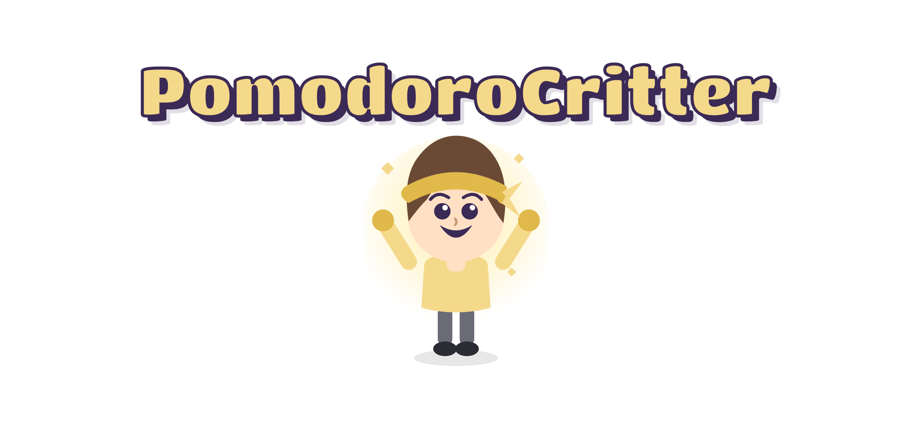

<p align="center">
  
</p>

<p align="center">
  
  
  
</p>

<p align="center">
A pastel Pomodoro companion. A small ninja critter reacts to your focus sessions, sleepy 
when idle, brightening as sessions complete, glowing once momentum builds!
</p>

## How it works

Pick a session length, hit Start, and watch the timer count down. Complete a full
session and the critter's mood shifts. Complete enough sessions and it reaches its most
excited state.

| Sleepy | Neutral | Happy | Glowing |
|---|---|---|---|
|  |  |  |  |

## Stack

- **Backend**: Java, `com.sun.net.httpserver.HttpServer`, no external dependencies
- **Frontend**: HTML, CSS, JavaScript, no build step
- **Design system**: [Impeccable](https://impeccable.style), see `.impeccable/design.json`
- **Testing**: Playwright CLI for end-to-end verification

## Running it

```bash
javac -d out src/main/java/pomodorocritter/*.java
java -cp out pomodorocritter.PomodoroServer
```

Then open `http://localhost:8080`.

## Session length

Pick a preset or set a custom time. Sessions under 15 minutes still count down and
still take time off the clock, but only sessions of 15 minutes or longer log toward
your session count and move the critter's mood forward. The app will let you know if
your chosen length is too short to count.

## Project structure

```
PomodoroCritter/
├── .impeccable/
│   └── design.json (Design System)
├── exports/
│   ├── critter-sleepy.png
│   ├── critter-neutral.png
│   ├── critter-happy.png
│   ├── critter-glowing.png
│   ├── typography-reference.png
│   └── readme-header.png
├── src/main/java/pomodorocritter/
│   ├── Critter.java (Mood + Session Count)
│   ├── Mood.java (Sleepy, Neutral, Happy, Glowing)
│   ├── SessionLog.java (Session Count Tracking)
│   ├── PomodoroTimer.java (Countdown State Machine)
│   ├── PomodoroServer.java (HTTP Server, Ticks The Timer, Serves The Frontend)
│   ├── PomodoroCritterFrame.java (Original Swing UI, Kept For Reference)
│   └── CritterPanel.java (Original Swing Rendering, Kept For Reference)
├── web/
│   ├── index.html
│   ├── style.css
│   └── app.js
└── README.md
```

## Origin

Originally built as a Java Swing desktop app, later rewritten with an HTML/CSS/JS
frontend served by a lightweight Java backend. The original Swing files are kept in
the repo, unused, as a record of that first pass. 

## Important Note

Session count, total qualifying minutes, and mood live in the server's memory, not in a
file or database. That means:

- Closing the browser tab or reopening it doesn't lose anything, the server keeps the
  state running in the background.
- Stopping the Java server (closing the terminal it's running in, Ctrl+C, restarting
  your computer) resets everything back to zero, since nothing's saved to disk.

Keep the server running in the background if you want your stats to keep building
across a full day of use.
